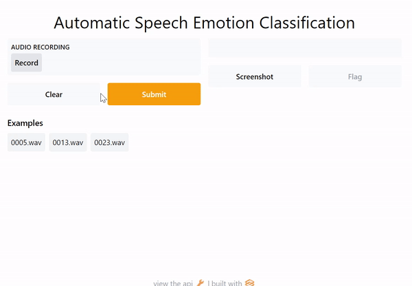

# Speech-Emotion-Recognition-App

<p align="center"> 
    
</p>

A real-time speech emotion recognition application using Scikit-learn and gradio.

## Requirements
- librosa==0.6.3 
- numpy 
- soundfile==0.9.0 
- sklearn 
- pyaudio==0.2.11 
- gradio

## pipeline
- Dataset: [RAVDESS dataset](https://www.kaggle.com/uwrfkaggler/ravdess-emotional-song-audio)
- Feature Extraction: MFCC, Chroma, and Mel Frequency Cepstrum
- Model: Multi Layer Perceptron classifier
- Accuracy: ~76% with 4 classes ["angry","sad", "neutral","happy"]

## Training
```
python train.py
```

## Demo
```
python app.py
```
